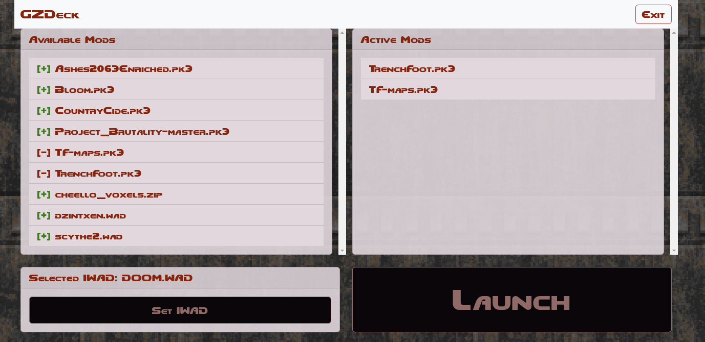

# GZDeck Rust

Port of GZdeck to Rust using iced.

## Reference

GZDeck UI looks like this:

## Notes

- Same: GUI layout as GZDeck
- New: Extend compatibility to windows (GZdoom), MacOS (GZdoom), and Linux (GZdoom)

## TODO

- [ ] 1280x800 window
  - [ ] GUI layout
- [ ] Launch GZdoom
  - [ ] testable on win and Mac
- [ ] IWAD scanning and selection
- [ ] PWAD scanning

### Stretch

- [ ] Hot reloading